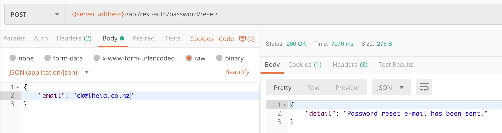
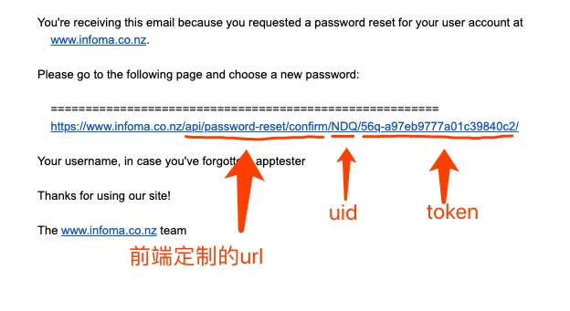
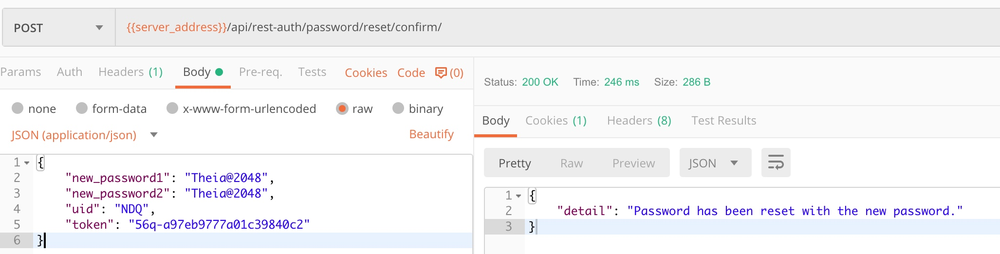

# django-rest-auth

## How to customize password reset email content

URL /rest-auth/password/reset/

**设置邮箱，确保重置邮件能发出去**
```python
EMAIL_HOST = 'smtp.gmail.com'
EMAIL_USE_SSL = True
EMAIL_PORT = 465
EMAIL_HOST_USER = 'no-reply@infoma.xxx'
EMAIL_HOST_PASSWORD = 'xxxxxx'
EMAIL_FROM = 'No-Reply<no-reply@infoma.xxx>'
```

**复制邮件模版**

```shell
$ cp site-packages/django/contrib/admin/templates/registration/password_reset_email.html proj/templates/registration/
```

**编辑模版**

**使用**
- Send reset request
写个页面接受用户邮件地址，发送给api， 这个api无需身份认证



- Receive email
写个页面把URL给我，我设置到邮件里，前端页面获取uid 和 token



- 填写新密码
Post uid and token to below api then reply user according to the response.

