# Django Admin Technique Summary

[TOC]

## 1. 配置开发环境和发布环境
### 1. 将 `settings.py` 拆分为多个文件

```shell
./
../
__init__.py
__pycache__/
defaults.py
dev.py
production.py
```

[【参考例子】](https://code.djangoproject.com/wiki/SplitSettings#SimplePackageOrganizationforEnvironments)


这个例子有两个坑：
1. 引入defaults等要加'.'

```python
# __init__.py
from .defaults import *

DEBUG = True
```

```python
from .defaults import *

DEBUG = True

DATABASES = {
    'default': {
        'ENGINE': 'django.db.backends.postgresql',
        'NAME': 'postgres',
        'USER': 'postgres',
        'PASSWORD': 'xxxx',
        'HOST': 'db',
        'PORT': 5432,
    }
}
```

1. 由于修改了settings 的位置，所以配置里的 BASE_DIR 也要相应的改变。

```python
BASE_DIR = os.path.dirname(os.path.dirname(os.path.abspath(__file__)))
BASE_DIR = os.path.join(BASE_DIR, '..')  # After move the settings.py into settings/defaults.py
```

### 2. 准备docker-compose.yml

```docker
version: '3.6'

services:
  db:
    image: postgres
    container_name: oa-postgres # 选填，只是为了一行进入容器或者 docker run 方便
    restart: always
    environment:
      POSTGRES_PASSWORD: xxxx   # 试过不给密码，服务器总是出错
    volumes:
      - ./pgdata:/var/lib/postgresql/data/  # 有点小问题，本地目录的所有者是 999:root

  web:
    build: .
    container_name: oa-web
    image: theia_oa:latest
    environment:
      - DJANGO_SETTINGS_MODULE=theia_oa.settings.production # 告诉 uwsgi 和 Django 配置文件在哪里
    command: uwsgi /docker_api/uwsgi.ini
    volumes:
      - .:/docker_api
    ports:
      - "8888:8888"
    depends_on:
      - db
```

> 关于 postgres 的本地目录的所有者问题，只能 `sudo chown ubuntu:ubuntu -R pgdata` 解决了

### 3. 修改 wsgi.py

```python
from django.core.wsgi import get_wsgi_application
# 这里其实重复了，不设置也行，不过怕以后改的话无从改起保留吧，但要跟docker-compose设置但环境变量相同
os.environ.setdefault('DJANGO_SETTINGS_MODULE', 'theia_oa.settings.production')

application = get_wsgi_application()
```


# Django Admin 设置
> Django自带的后台管理是Django明显特色之一，可以让我们快速便捷管理数据。后台管理可以在各个app的admin.py文件中进行控制。以下是我最近摸索总结出比较实用的配置。若你有什么比较好的配置，欢迎补充。

## 一、基本设置

### 1、应用注册
若要把app应用显示在后台管理中，需要在admin.py中注册。这个注册有两种方式，我比较喜欢用装饰器的方式。

先看看普通注册方法。打开admin.py文件，如下代码：

```python
from django.contrib import admin
from blog.models import Blog
  
#Blog模型的管理器
class BlogAdmin(admin.ModelAdmin):
    list_display=('id', 'caption', 'author', 'publish_time')
     
#在admin中注册绑定
admin.site.register(Blog, BlogAdmin)
```

上面方法是将管理器和注册语句分开。有时容易忘记写注册语句，或者模型很多，不容易对应。
还有一种方式是用装饰器，该方法是Django1.7的版本新增的功能：

```python
from django.contrib import admin
from blog.models import Blog
  
#Blog模型的管理器
@admin.register(Blog)
class BlogAdmin(admin.ModelAdmin):
    list_display=('id', 'caption', 'author', 'publish_time')
```
该方式比较方便明显，推荐用这种方式。

### 2. admin界面汉化

默认admin后台管理界面是英文的，对英语盲来说用起来不方便。

可以在settings.py中设置：

```python
LANGUAGE_CODE = 'zh-CN'
TIME_ZONE = 'Asia/Shanghai'
# 1.8版本之后的language code设置不同：
LANGUAGE_CODE = 'zh-hans'
TIME_ZONE = 'Asia/Shanghai'
```

## 二、记录列表界面设置

记录列表是我们打开后台管理进入到某个应用看到的界面，如下所示：

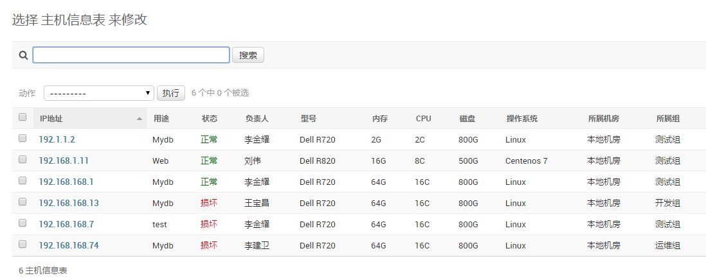


我们可以对该界面进行设置，主要包括列表和筛选器。

### 1. 记录列表基本设置

比较实用的记录列表设置有显示字段、每页记录数和排序等。

```python
from django.contrib import admin
from blog.models import Blog
  
#Blog模型的管理器
@admin.register(Blog)
class BlogAdmin(admin.ModelAdmin):
    #listdisplay设置要显示在列表中的字段（id字段是Django模型的默认主键）
    list_display = ('id', 'caption', 'author', 'publish_time')
    
    #list_per_page设置每页显示多少条记录，默认是100条
    list_per_page = 50
    
    #ordering设置默认排序字段，负号表示降序排序
    ordering = ('-publish_time',)
  
    #list_editable 设置默认可编辑字段
    list_editable = ['machine_room_id', 'temperature']
  
    #fk_fields 设置显示外键字段
     fk_fields = ('machine_room_id',)
```

此处比较简单，自己尝试一下即可。

默认可以点击每条记录第一个字段的值可以进入编辑界面。 


我们可以设置其他字段也可以点击链接进入编辑界面。

```python
from django.contrib import admin
from blog.models import Blog
  
#Blog模型的管理器
@admin.register(Blog)
class BlogAdmin(admin.ModelAdmin):   
    #设置哪些字段可以点击进入编辑界面
    list_display_links = ('id', 'caption')
```

### 2. 筛选器

筛选器是Django后台管理重要的功能之一，而且Django为我们提供了一些实用的筛选器。

主要常用筛选器有下面3个：

```python
from django.contrib import admin
from blog.models import Blog
  
#Blog模型的管理器
@admin.register(Blog)
class BlogAdmin(admin.ModelAdmin):
    list_display = ('id', 'caption', 'author', 'publish_time')
     
    #筛选器
    list_filter =('trouble', 'go_time', 'act_man__user_name', 'machine_room_id__machine_room_name') #过滤器
    search_fields =('server', 'net', 'mark') #搜索字段
    date_hierarchy = 'go_time'    # 详细时间分层筛选　
```

对应效果如下：


> 此处注意：
> 使用  date_hierarchy  进行详细时间筛选的时候 可能出现报错：Database returned an invalid datetime value. Are time zone definitions for your database and pytz installed?
>
> 处理方法：  
>
> 命令行直接执行此命令：     [root@mysql ~]#    mysql_tzinfo_to_sql /usr/share/zoneinfo | mysql -u root mysql
> 然后重启数据库即可。

一般ManyToManyField多对多字段用过滤器；标题等文本字段用搜索框；日期时间用分层筛选。

### 3. 定义搜索的字段范围

- 过滤器如果是外键需要遵循这样的语法：本表字段__外键表要显示的字段。如：“user__user_name”
```
search_fields = ['foreinkeyfield__name']
# or
search_fields = ['foreinkeyfield__foreinkeyfield__name']
```

### 4. 颜色显示

==在模型中自定义函数==
想对某些字段设置颜色，可用下面的设置：

```python
from django.db import models
from django.contrib import admin
from django.utils.html import format_html
 
class Person(models.Model):
    first_name = models.CharField(max_length=50)
    last_name = models.CharField(max_length=50)
    color_code = models.CharField(max_length=6)
 
    def colored_name(self):
        return format_html(
            '<span style="color: #{};">{} {}</span>',
            self.color_code,
            self.first_name,
            self.last_name,
        )
 
class PersonAdmin(admin.ModelAdmin):
    list_display = ('first_name', 'last_name', 'colored_name')
```

实际代码（注意看上面代码，是写在models里，而不是admin中的ModelAdmin里）：

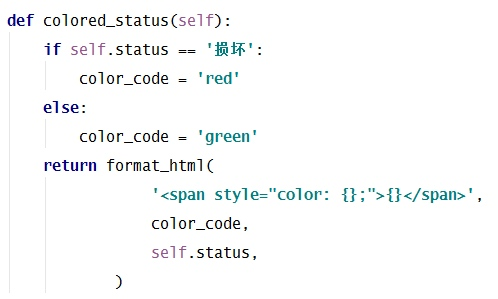

效果：

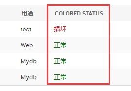


但是，我们看到标题并不是我们想要的，那么==如何设置标题==呢？

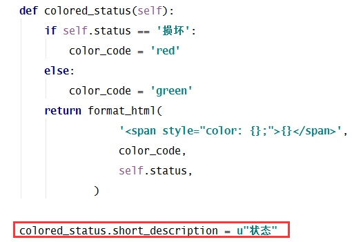


在函数结束之后添加上面代码即可

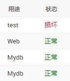


### 5. 调整页面头部显示内容和页面标题

```python
class MyAdminSite(admin.AdminSite):
    site_header = '好医生运维资源管理系统'  # 此处设置页面显示标题
    site_title = '好医生运维'  # 此处设置页面头部标题
 
admin_site = MyAdminSite(name='management')
```
> 需要注意的是：  admin_site = MyAdminSite(name='management') 此处括号内name值必须设置，否则将无法使用admin设置权限，至于设置什么值，经本人测试，没有影响。
> 
> 注册的时候使用admin_site.register，而不是默认的admin.site.register。


效果：

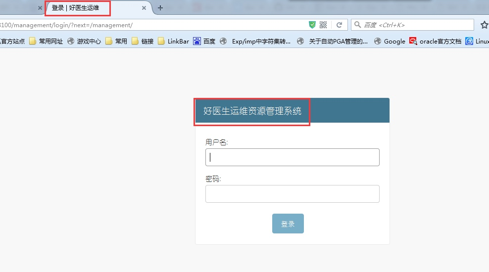


后经网友提示发现也可以这样：

```python
from django.contrib import admin
from hys_operation.models import *
 
 
# class MyAdminSite(admin.AdminSite):
#     site_header = '好医生运维资源管理系统'  # 此处设置页面显示标题
#     site_title = '好医生运维'
#
# # admin_site = MyAdminSite(name='management')
# admin_site = MyAdminSite(name='adsff')
admin.site.site_header = '修改后'
admin.site.site_title = '哈哈'
```

不继承 admin.AdminSite 了，直接用admin.site 下的 site_header 和 site_title 。


更加简单方便，容易理解。  唯一的区别就是 这种方法 是登录http://ip/admin/

站点和用户组在一起

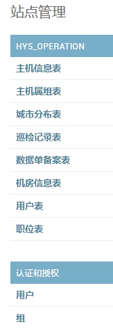


而第一种方法是分开的。

我本人更倾向于修改project/urls.py, 添加如下行

```python
admin.site.site_header = 'Theia Office Administration'  # default: "Django Administration"
admin.site.index_title = 'Features area'                # default: "Site administration"
admin.site.site_title = 'Theia'
admin.site.site_url = ''
```

### 6. 通过当前登录的用户过滤显示的数据

官方文档的介绍：


实际代码和效果：

```python
@admin.register(MachineInfo)
class MachineInfoAdmin(admin.ModelAdmin):
 
    def get_queryset(self, request):
        """函数作用：使当前登录的用户只能看到自己负责的服务器"""
        qs = super(MachineInfoAdmin, self).get_queryset(request)
        if request.user.is_superuser:
            return qs
        return qs.filter(user=UserInfo.objects.filter(user_name=request.user))
 
    list_display = ('machine_ip', 'application', 'colored_status', 'user', 'machine_model', 'cache',
                    'cpu', 'hard_disk', 'machine_os', 'idc', 'machine_group')
```


### 7. 添加自定义动作

如果在 model 定义了soft delete()
很抱歉，在 Admin 的 "delete selected objects" 是不会调用的

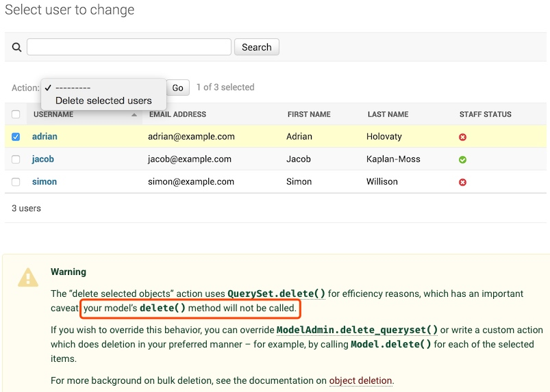

[官方解释](https://docs.djangoproject.com/en/2.1/ref/contrib/admin/actions/)

可以禁用掉另写一个，这同时就演示了如何添加个人action 到Action下拉框


## 三、编辑界面设置

编辑界面是我们编辑数据所看到的页面。我们可以对这些字段进行排列设置等。

若不任何设置，如下图所示：

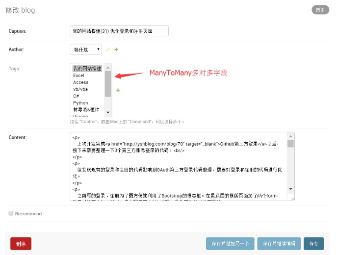

这个界面比较简陋，需要稍加设置即可。

### 1. 编辑界面设置

首先多ManyToMany多对多字段设置。可以用filter_horizontal或filter_vertical：

**Many to many 字段**

```python
filter_horizontal=('tags',)
```

效果如下图：


这样对多对多字段操作更方便。

另外，可以用fields或exclude控制显示或者排除的字段，二选一即可。

例如，我想只显示标题、作者、分类标签、内容。不想显示是否推荐字段，可以如下两种设置方式：

```python
fields =  ('caption', 'author', 'tags', 'content')
```

或者

```python
exclude = ('recommend',) #排除该字段
```

设置之后，你会发现这些字段都是一个字段占一行。若想两个字段放在同一行可以如下设置：

```python
fields =  (('caption', 'author'), 'tags', 'content')
```

效果如下：

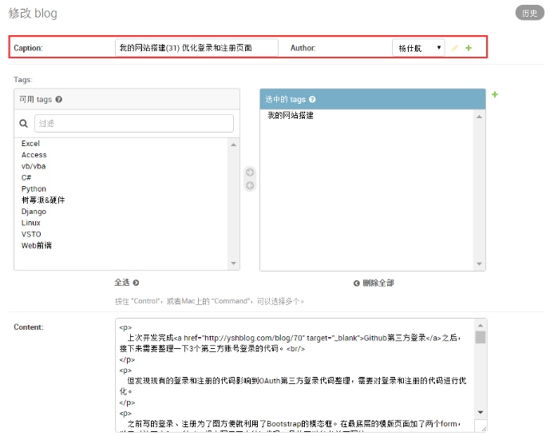

### 2. 编辑字段集合

不过，我不怎么用fields和exclude。用得比较多的是fieldsets。该设置可以对字段分块，看起来比较整洁。如下设置：

```python
fieldsets = (
    ("base info", {'fields': ['caption', 'author', 'tags']}),
    ("Content", {'fields':['content', 'recommend']})
)
```
效果如下：
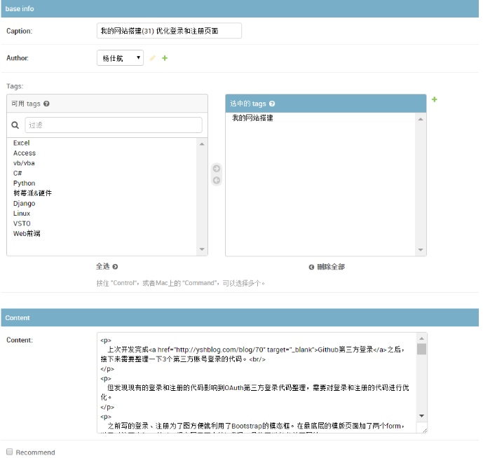


### 3. 一对多关联

还有一种比较特殊的情况，父子表的情况。编辑父表之后，再打开子表编辑，而且子表只能一条一条编辑，比较麻烦。

这种情况，我们也是可以处理的，将其放在同一个编辑界面中。

例如，有两个模型，一个是订单主表(BillMain)，记录主要信息；一个是订单明细(BillSub)，记录购买商品的品种和数量等。

admin.py如下：

```python
#coding:utf-8
from django.contrib import admin
from bill.models import BillMain, BillSub
 
@admin.register(BillMain)
class BillMainAdmin(admin.ModelAdmin):
    inlines = [BillSubInline,]    #Inline把BillSubInline关联进来
    list_display = ('bill_num', 'customer',)
    
class BillSubInline(admin.TabularInline):
    model = BillSub
    extra = 5 #默认显示条目的数量
```

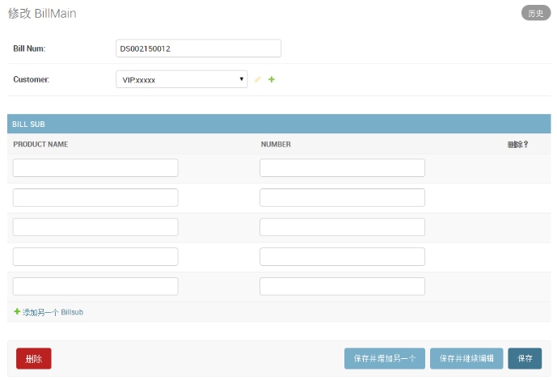

这样就可以快速方便处理数据。
相关的admin比较有用的设置大致这些，若你觉得还有一些比较有用的，可以留意参与讨论。
这个InlineAdmin里面也是可以定义很多东西的，类似一个Admin

### 4. 设置只读字段

在使用admin的时候，ModelAdmin默认对于model的操作只有增加，修改和删除，但是总是有些字段是不希望用户来编辑的。而 readonly_fields 设置之后不管是admin还是其他用户都会变成只读，而我们通常只是想限制普通用户。 这时我们就可以通过重写 get_readonly_fields 方法来实现对特定用户的只读显示。

[官方介绍](https://docs.djangoproject.com/en/2.1/ref/contrib/admin/#django.contrib.admin.ModelAdmin.get_readonly_fields)


```python
class MachineInfoAdmin(admin.ModelAdmin):
 
    def get_readonly_fields(self, request, obj=None):
        """  重新定义此函数，限制普通用户所能修改的字段  """
        if request.user.is_superuser:
            self.readonly_fields = []
        return self.readonly_fields
     
    readonly_fields = ('machine_ip', 'status', 'user', 'machine_model', 'cache',
                       'cpu', 'hard_disk', 'machine_os', 'idc', 'machine_group')
```


### 5. 数据保存时进行一些额外的操作（通过重写ModelAdmin的save_model实现）


```python
def save_model(self, request, obj, form, change):
    """  重新定义此函数，提交时自动添加申请人和备案号  """
 
    def make_paper_num():
        """ 生成随机备案号 """
        import datetime
        import random
        CurrentTime = datetime.datetime.now().strftime("%Y%m%d%H%M%S")  # 生成当前时间
        RandomNum = random.randint(0, 100)  # 生成的随机整数n，其中0<=n<=100
        UniqueNum = str(CurrentTime) + str(RandomNum)
        return UniqueNum
 
    obj.proposer = request.user
    obj.paper_num = make_paper_num()
    super(DataPaperStoreAdmin, self).save_model(request, obj, form, change)
```

这样，在添加数据时，会自动保存申请人和备案号。

我们也可以在修改数据时获取保存前的数据：
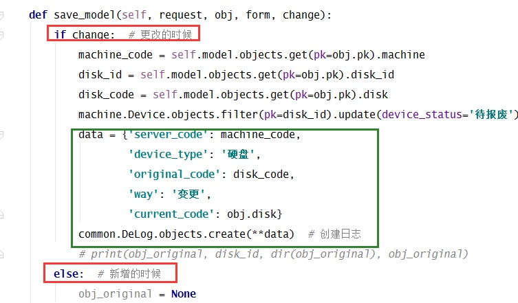


通过change参数，可以判断是修改还是新增，同时做相应的操作。上述代码就是在替换磁盘的时候修改状态，并写入日志。

```python
def save_model(self, request, obj, form, change):
    if change:  # 更改的时候
        machine_code = self.model.objects.get(pk=obj.pk).machine
        disk_id = self.model.objects.get(pk=obj.pk).disk_id
        disk_code = self.model.objects.get(pk=obj.pk).disk
        machine.Device.objects.filter(pk=disk_id).update(device_status='待报废')
        data = {'server_code': machine_code,
                'device_type': '硬盘',
                'original_code': disk_code,
                'way': '变更',
                'current_code': obj.disk}
        common.DeLog.objects.create(**data)  # 创建日志
    else:  # 新增的时候
        data = {'server_code': obj.machine,
                'device_type': '硬盘',
                'original_code': '',
                'way': '新增',
                'current_code': obj.disk}
        common.DeLog.objects.create(**data)  # 创建日志
    super(MachineExDiskAdmin, self).save_model(request, obj, form, change)
```

同样的，还有delete_model：

```python
def delete_model(self, request, obj):
    machine.Device.objects.filter(pk=obj.pk).update(device_status='待报废')
    data = {'server_code': obj.machine,
            'device_type': '硬盘',
            'original_code': obj.disk,
            'way': '删除',
            'current_code': '',
            'user_name': request.user}
    common.DeLog.objects.create(**data)  # 创建日志
    super(MachineExDiskAdmin, self).delete_model(request, obj)
```

### 6. 修改模版 chang_form.html 让普通用户 无法看到 “历史” 按钮。

默认 普通用户下 是存在 “历史” 按钮的：

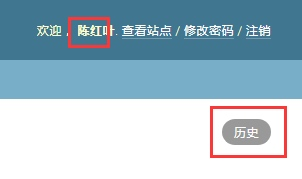
此时  chang_form.html  的代码为：

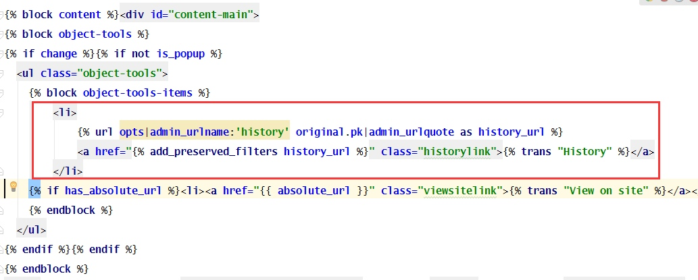
我们将代码修改为：


这样，就可以限制 只让管理员看到历史 按钮了。普通用户看不到了：

### 7. 对单条数据 显示样式的修改

需求如下：


每条数据都有 个确认标识（上图红框中），如果已经确认，用户再点击进入查看信息的时候全部只读显示，即不能在做修改，如果没确认在可以修改。如下：

已确认：

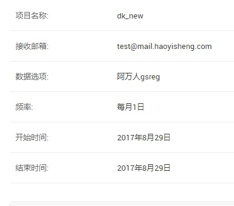

未确认：
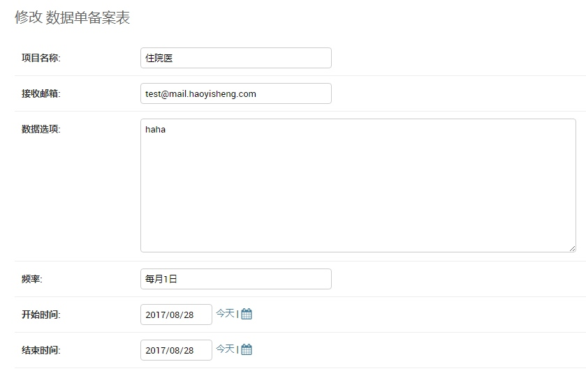


实现方法：
change_view 方法 和 get_readonly_fields 方法 配合，代码：

```python
def get_readonly_fields(self, request, obj=None):
    """  重新定义此函数，限制普通用户所能修改的字段  """
    if request.user.is_superuser:
        self.readonly_fields = ['commit_date', 'paper_num']
    elif hasattr(obj, 'is_sure'):
        if obj.is_sure:
            self.readonly_fields = ('project_name', 'to_mail', 'data_selected', 'frequency', 'start_date',
                                    'end_date')
    else:
        self.readonly_fields = ('paper_num', 'is_sure', 'proposer', 'sql', 'commit_date')
 
    return self.readonly_fields
 
def change_view(self, request, object_id, form_url='', extra_context=None):
    change_obj = DataPaperStore.objects.filter(pk=object_id)
    self.get_readonly_fields(request, obj=change_obj)
    return super(DataPaperStoreAdmin, self).change_view(request, object_id, form_url, extra_context=extra_context)
```

> change_view方法，允许您在渲染之前轻松自定义响应数据。（凡是对单条数据操作的定制，都可以通过这个方法配合实现）
[【官方介绍】](https://docs.djangoproject.com/en/2.1/ref/contrib/admin/#django.contrib.admin.ModelAdmin.change_view)

```python
class MyModelAdmin(admin.ModelAdmin):

    # A template for a very customized change view:
    change_form_template = 'admin/myapp/extras/openstreetmap_change_form.html'

    def get_osm_info(self):
        # ...
        pass

    def change_view(self, request, object_id, form_url='', extra_context=None):
        extra_context = extra_context or {}
        extra_context['osm_data'] = self.get_osm_info()
        return super().change_view(
            request, object_id, form_url, extra_context=extra_context,
        )
```

如果只是调整初始化数据，这样就够了


```python
def get_changeform_initial_data(self, request):
        """
        Provide initial datas when creating an Ad.
        """
        get_data = super(CommonImageAdmin, self).get_changeform_initial_data(request)
        return get_data or {
            'owner': request.user.pk
        }
```


### 8. 修改app的显示名称

Dajngo在Admin后台默认显示的应用的名称为创建app时的名称。

我们如何修改这个app的名称达到定制的要求呢，其实Django已经在文档里进行了说明。

从Django1.7以后不再使用app_label，修改app相关需要使用AppConfig。我们只需要在应用的__init__.py里面进行修改即可：

```python
from django.apps import AppConfig


class CrmConfig(AppConfig):
    name = 'crm'
    verbose_name = 'Customer Management'
```

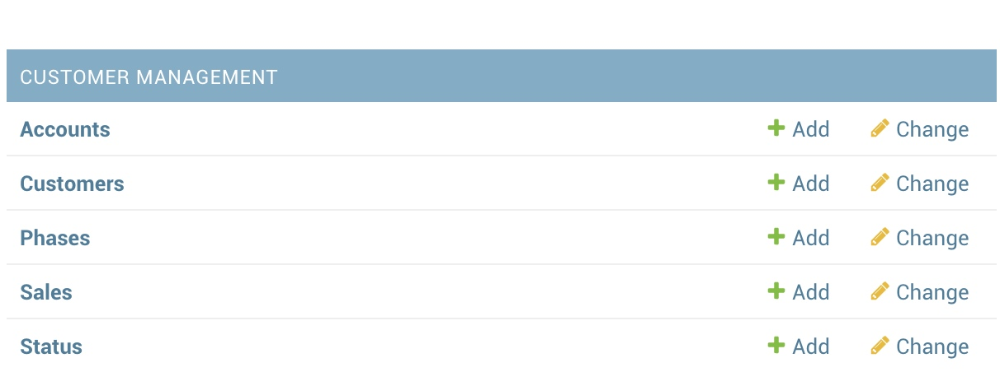

### 9. 自定义列表字段

上面的一对多和多对多可以数据编辑中显示，但在列表中没有显示。  
有时还需要显示一些其他东西。例如两个字段相乘计算结果等等。  
这些都可以通过自定义列表字段处理和显示。

例如，两个模型Blog和Tag。多对多关系。简单模型代码如下：

```python
class Tag(models.Model):
    tag_name = models.CharField(max_length=20,blank=True)
     
class Blog(models.Model):
    caption = models.CharField(max_length=20,blank=True)
    tags = models.ManyToManyField(Tag,blank=True)
```

ModelAdmin 中的自定义函数可以有两个参数，`self` 和 **当前对象**。  
在Blog模型中有tags字段，但admin列表显示不能直接用该字段，也显示不出来。可以通过自定义列表字段显示。如下设置admin：

```python
#coding:utf-8
from django.contrib import admin
from blog.models import Blog, Tag
  
# Blog模型的管理器
@admin.register(Blog)
class BlogAdmin(admin.ModelAdmin):
    # listdisplay添加 tags_list 不存在的字段名
    list_display = ('id', 'caption', 'tags_list')
     
    # 定义tags_list，方法名和tags_list一致
    def tags_list(self, blog):
        """自定义列表字段"""
        tag_names = map(lambda x: x.tag_name, blog.tags.all())
        return ', '.join(tag_names)
```

通过自定义列表字段，获取相关数据再列表中显示，效果如下：


### 10. 自动填充相应字段

参考了博客：
https://www.cnblogs.com/wumingxiaoyao/p/6928297.html
参考网站：
http://code.ziqiangxuetang.com/django/django-admin.html
http://django-intro-zh.readthedocs.io/zh_CN/latest/part2/
http://python.usyiyi.cn/translate/django_182/ref/contrib/admin/index.html
https://www.ibm.com/developerworks/cn/opensource/os-django-admin/
http://www.cnblogs.com/linxiyue/p/4074141.html