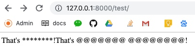

# Filter out Profanity

 

**Install**
```
pipenv install profanityfilter
```

**Create a new Django Proj**

```python
# settings.py
INSTALLED_APPS = [
    'profanityfilter',
]
profanityfilter
```

```python
# views.py
from django.shortcuts import render
from django.http import HttpResponse
from profanityfilter import ProfanityFilter


def test(requeset):
    pf = ProfanityFilter()

    foo = pf.censor("That's bullshit!")
    print(foo)
    pf.set_censor("@")
    bar = pf.censor("That's fucking bullshit!")
    print(bar)
    return HttpResponse(foo + bar)
```

```pyhon
# urls.py
from django.contrib import admin
from django.urls import path
from . import views

urlpatterns = [
    path('admin/', admin.site.urls),
    path('test/', views.test)
]

```


