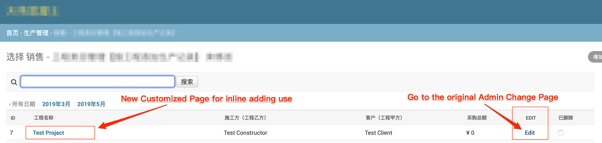
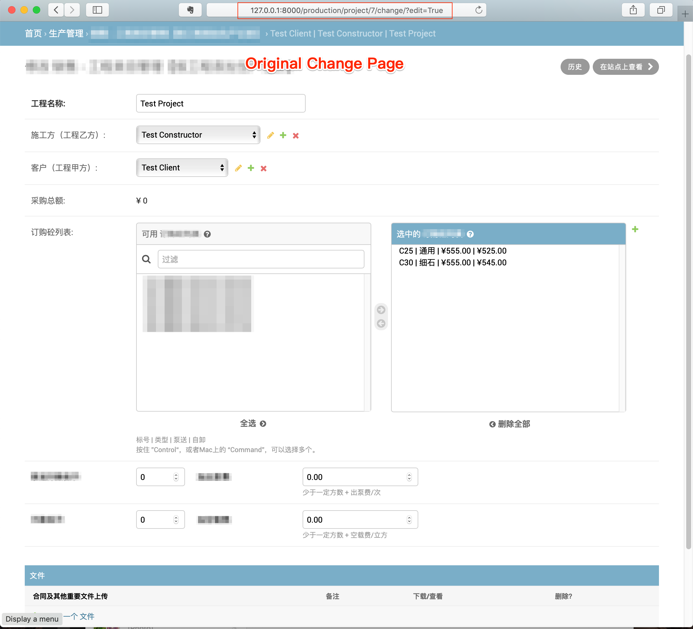
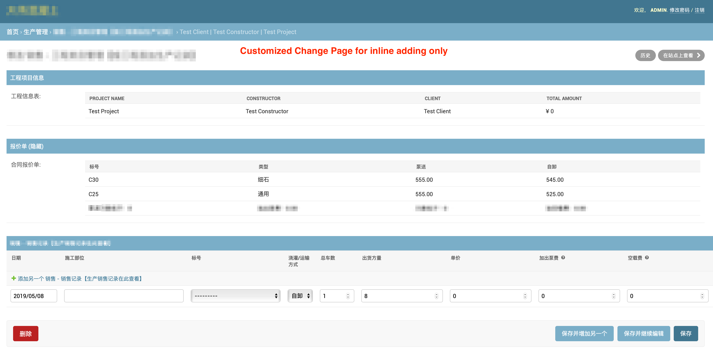

# Show model fields as Table in Admin Change Page

**Problem:**

I have a project model and its inline models lets say *InlineModel_1* and *InlineModel_2*.

I want the Project's Add & Change pages can create or edit the Project's fields and *InlineModel_1*,  Besides, an extra *Change Page* specific for review the Project info and edit *InlineModel_2*


**Result:**

1. **In Changelist Page**  

   Add a link to **Original Chang Page** and use original link to go to the customized **Change Page**




2. **Original Change Page**




3. New **Customized Change Page** for inline adding use




**Procedure**

1. Setup ProjectAdmin and add a link field to **Original *Change Page***

   ```python
   class ProjectAdmin(BaseAdmin):
       list_display = ('id', 'name', 'constructor', 'client',
                       'total_amount', 'edit_tag',
       readonly_fields = ('total_amount', 'order_form', 'project_info_table')
       # only used in add_view()
       default_fields = (
           'name',
           'constructor',
           'client',
           'total_amount',
       )
       default_fieldset = (
           ('工程项目信息', {
               'fields': ('project_info_table',)
           }),
           ('报价单', {
               'classes': ('collapse',),
               'fields': ('order_form',),
           }),
       )
                       
       # a link to orginal Change Page
       def edit_tag(self, obj):
           return mark_safe(
               f'<a href="{obj.get_absolute_url()}?edit=True">Edit</a>'
           )
   
       edit_tag.short_description = 'Edit'
   ```

   

2. Add method to ModelAdmin to generate Table Html with field values

   ```python
   class Project(BaseModel):
   		# ....
       # generate table1 html
   		def project_info_table(self):
   				# just one row, use thead only instead of a whole table
           table = """
              <table style="width:100%">
                  <thead>
                  <tr>
                      <th>Project name</th>
                      <th>Constructor</th>
                      <th>Client</th>
                      <th>Total amount</th>
                  </tr>
                  </thead>
                  <tbody>
                  <tr>
                      <td>{}</td>
                      <td>{}</td>
                      <td>{}</td>
                      <td>{}</td>
                   </tr>
                  </tbody>
              </table>
              """
           return format_html(
               table,
               self.name,
               self.constructor,
               self.client,
               self.total_amount()
           )
   
       project_info_table.short_description = '工程信息表'
       
       # generate table2 html
       def order_form(self):
           table = """
               <table style="width:100%">
                   <thead>
                   <tr>
                       <th>标号</th>
                       <th>类型</th>
                       <th>泵送</th>
                       <th>自卸</th>
                   </tr>
                   </thead>
                   <tbody>{}{}</tbody>
               </table>
               """
           return format_html(
               table,
             	
             	# format_html_join can repeat the row with the values
             	# from a iterator
               format_html_join(
                   '\n', "<tr><td>{}</td><td>{}</td><td>{}</td><td>{}</td></tr>",
                   ((
                       p.grade, p.type, p.pumpcrete, p.dumpcrete
                   ) for p in self.products.all().order_by(
                       '-grade', 'type', 'pumpcrete'
                   ))
               ),
               format_html("<tr><td>泵送方数低于：{}</td><td>加出泵费：{}</td><td>方数低于：{}</td><td>加空载费：{}</td></tr>",
                           self.min_cube_pump,
                           self.price_pump,
                           self.min_cube_extra,
                           self.price_extra
                           )
           )
   
       order_form.short_description = '合同报价单'    
       
       # another readonly field
       def total_amount(self):
           result = self.transaction_set.filter(
             is_deleted=False
           ).aggregate(
               Sum('total_price')
           )['total_price__sum'] or 0
           return '¥ {:,}'.format(result)
   ```

   

3. If want to keep the original **Change Page** and the above **Inline Change Page**, override change_view method in admin to show

   ```python
   class ProjectAdmin(BaseAdmin):
   		....
       
       # different fields and inline according to GET method's parameter
       # need to reset fields and fieldset in different view
       
       def change_view(self, request, object_id, form_url='',
                       extra_context=None):
       		if request.GET.get('edit', False):
               # Show original Change Page
               
             	# Don't use fieldset cause it's only for customized page
               self.fieldsets = None
               self.fields = self.default_fields
               # able to user different inline for different page
               self.inlines = [DocumentInline]
           else:
               # Show customized page
               
               # don't sue fields use fieldset instead
               self.fields = None
               self.fieldsets = self.default_fieldset
               # use another inline for customized page
               self.inlines = [TransactionInline]
           return super().change_view(request, object_id,
                                      extra_context=extra_context)
         
   		def add_view(self, request, form_url='', extra_context=None):
           self.fieldsets = None
           self.fields = self.default_fields
           self.inlines = [DocumentInline]
           return super(ProjectAdmin, self).add_view(request)
   ```

   

