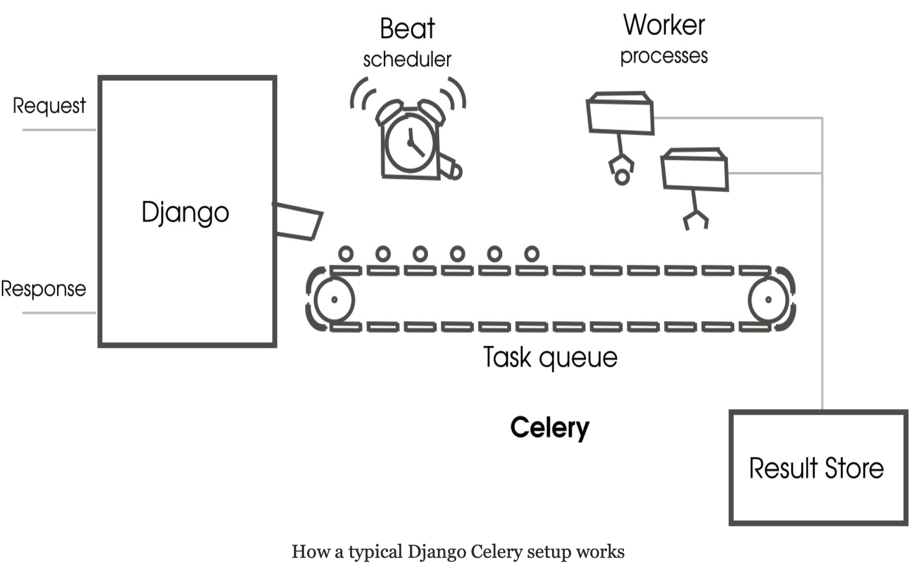

# Celery 异步发送邮件服务

> [Github]()



## Install
```


pipenv install django-celery
pipenv install celery-with-redis
```
```
celery==3.1.26.post2
  - billiard [required: >=3.3.0.23,<3.4, installed: 3.3.0.23]
  - kombu [required: >=3.0.37,<3.1, installed: 3.0.37]
    - amqp [required: >=1.4.9,<2.0, installed: 1.4.9]
    - anyjson [required: >=0.3.3, installed: 0.3.3]
  - pytz [required: >dev, installed: 2018.9]


django-celery==3.2.2
  - celery [required: >=3.1.15,<4.0, installed: ?]
  - django [required: >=1.8, installed: 2.1.5]
    - pytz [required: Any, installed: 2018.9]

celery-with-redis==3.0
  - celery [required: >=3.0,<4.0, installed: ?]
  - redis [required: >=2.4.4, installed: 3.0.1]
```