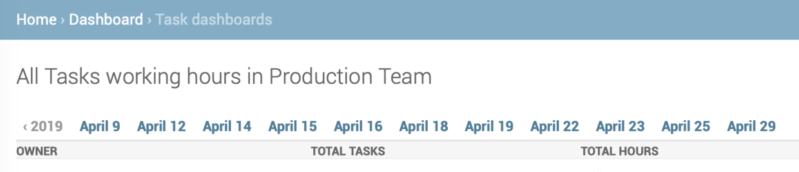
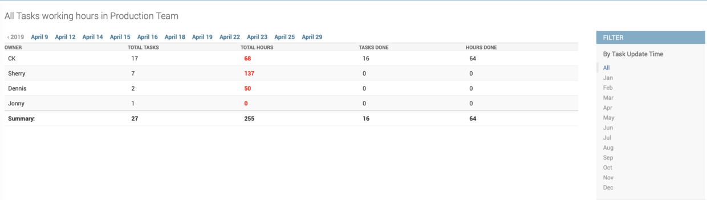

# Django Admin 按月份筛选

> How to set the list filtering only on years or the months
> Django 2.1.7
> Python 3.7


## 问题描述：

Django Admin Site `date_hierarchy` 会从年开始根据每一次筛选逐级细分到每天
比如点了 April 以后会重新细分到4月的有记录的日子



## 解决办法：
```py
# dashboard/admins.py

# 自定义一个Filter
class UpdatedAtFilter(admin.SimpleListFilter):
    title = 'Task Update Month'
    parameter_name = 'updated_month'

    # 菜单列表
    def lookups(self, request, model_admin):
        """
        List of values to allow admin to select
        """
        months = (
            (1, 'Jan'),
            (2, 'Feb'),
            (3, 'Mar'),
            (4, 'Apr'),
            (5, 'May'),
            (6, 'Jun'),
            (7, 'Jul'),
            (8, 'Aug'),
            (9, 'Sep'),
            (10, 'Oct'),
            (11, 'Nov'),
            (12, 'Dec')
        )
        return months

    def queryset(self, request, queryset):
        """
        Return the filtered queryset
        """
        if self.value():
            # DateTime Field can use __month to get its month value
            return queryset.filter(updated_at__month=self.value())
        else:
            return queryset


class TaskDashboardAdmin(admin.ModelAdmin):
    change_list_template = 'dashboard/task_dashboard_summary.html'
    date_hierarchy = 'updated_at'
    list_filter = (
        # 选用自己的filter
        UpdatedAtFilter,
    )

admin.site.register(TaskDashboard, TaskDashboardAdmin)
```

## 结果：


