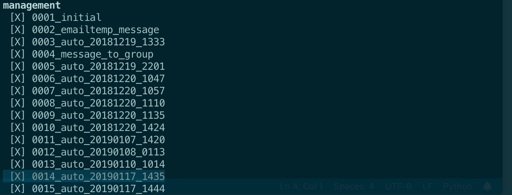
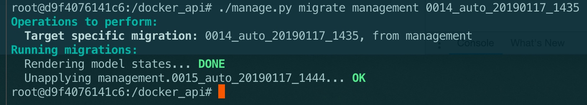
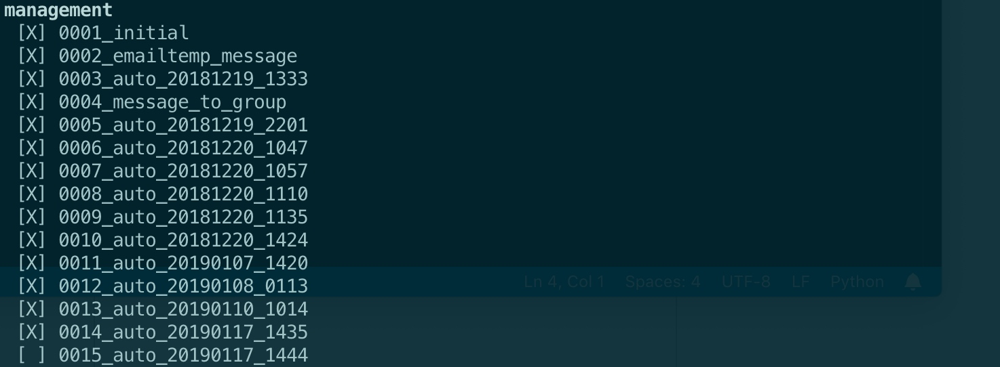
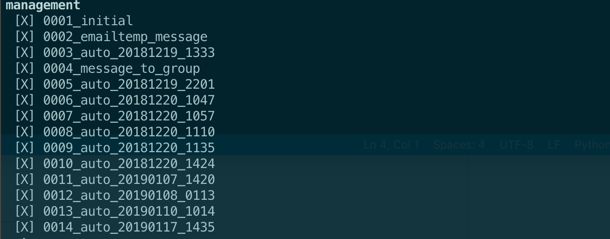
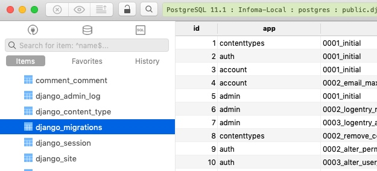
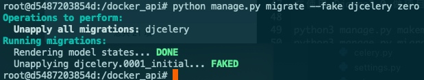
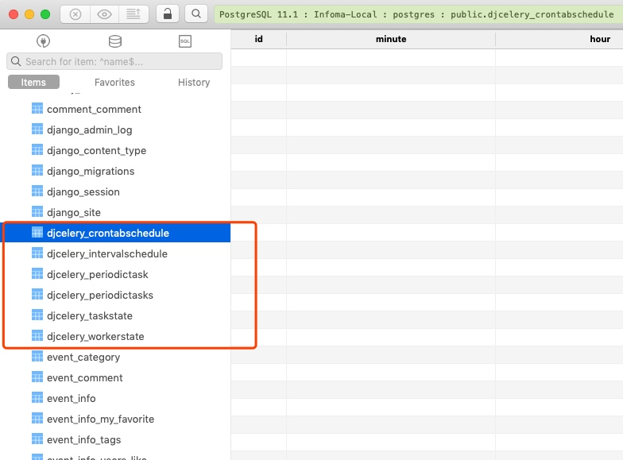

# Migration Summary

## 迁移准备

本地服务器更新
**以下步骤适用于本地开发环境（假定本地一份生产机上 schema 相同的数据库服务器）**
1. 查看有没有尚未执行的迁移动作
```
./manage.py showmigrations
```

2. 检查一下即将发生的迁移，只输出结果，不写迁移记录（生成记录文件和写入迁移表）
```
./manage.py makemigrations --dry-run
#   --dry-run   Just show what migrations would be made; don't
#               actually write them.
```

3. 检查是否有未迁移的模型改变，这个参数会导致迁移记录生成，这个参数有误导性，只是要检查应使用 --dry-run
```
./manage.py makemigrations --check
#  --check               Exit with a non-zero status if model changes are
#                        missing migrations.
```
执行完这步没有问题的话实际上以及 makemigrations 了

更新生产机上的 DB schema


其他参考
```sh
./manage.py showmigrations #check which already-made migrations have been applied or not
(or: ./manage.py showmigrations someApp #for specific app alone)

./manage.py makemigrations --dry-run #check for migrations to be made
(or: ./manage.py makemigrations someApp --dry-run #for specific app alone)

./manage.py makemigrations #make the migrations
(or: ./manage.py makemigrations someApp #for specific app alone)

./manage.py showmigrations #check which already-made migrations have been applied or not
(or: ./manage.py showmigrations someApp #for specific app alone)

./manage.py sqlmigrate someApp 0001 #view SQL changes for specific app & migration

./manage.py migrate #apply migrations
(or: ./manage.py migrate someApp #for specific app alone)

./manage.py showmigrations #check which already-made migrations have been applied or not
(or: ./manage.py showmigrations someApp #for specific app alone)

./manage.py makemigrations --dry-run #check for migrations to be made
(or: ./manage.py makemigrations someApp --dry-run #for specific app alone)

PS:
./manage.py migrate someApp zero #unapply all migrations for specific app
```


## 回退 Rollback 
### 到某个版本
You can revert by migrating to the previous migration.

For example, if your last migrations are:



Then you want to rollback to [1435]:

```
./manage.py migrate management 0014_auto_20190117_1435
```

After rollback:



the migration 0014_auto_20190117_1435 has been unapplied, as below




From app's migrations folder, delete migration file

```sh
rm 0015_auto_20190117_1444.py
```

```
./manage.py showmigrations
```


[Done]

### 回退到初始状态，就是没建表的状态
1. 删除迁移记录

```
./manage.py migrate my_app zero
```

2. 然后删掉迁移文件。
```
cd <app dir>
find . -path "./migrations/*.py" -not -name "__init__.py" -delete
find . -path "./migrations/*.pyc"  -delete
```

3. 重新初始化迁移
```
./manage.py makemigrations
```

4. 重新迁移
```
./manage.py migrate
```

## 精简迁移记录
> PS: Add `--fake` won't apply change to DB only delete the migrations records in `django-migrations` table

1. 不改变数据库结构，清除所有迁移记录
```sh
./manage.py migrate --fake my_app zero
```

意思就是只删除迁移记录:



并不真正去执行 SQL 回退，fake 就是假执行 SQL 的意思，可以用于清理迁移记录。

2. 然后删掉迁移文件。
```
cd <app dir>
find . -path "./migrations/*.py" -not -name "__init__.py" -delete
find . -path "./migrations/*.pyc"  -delete
```

3. 重建起始迁移文件
```
python manage.py makemigrations my_app
```

Result:

```
Migrations for 'my_app':
  0001_initial.py:
    - Create model MyModel
```

4. 再执行一次假迁移，因为表格这些之前都没动，所以不需要真正去执行 SQL。

```
python manage.py migrate --fake-initial
```

允许假迁移需要一个前提，就是这个`0001_initial.py` SQL 执行的创建表格等操作得到的结果（tables）跟现在已经存在的数据对应表格是完全一致的。
只要上面几步操作过程中没有改变过数据库就没什么问题。

*详见下一节：[删除已经新建并迁移了的表]*

## 删除已经新建并迁移了的表
> 安装了 django-celery 模块并迁移了数据，但是现在不想要这个模块了，这是经常出现的情况
>
> [Reference](https://simpleisbetterthancomplex.com/tutorial/2016/07/26/how-to-reset-migrations.html)

1. 确保模型跟当前数据结构匹配
Make sure your models fits the current database schema
The easiest way to do it is trying to create new migrations:

```sh
python manage.py makemigrations
No changes detected
```

If there are any pending migration, apply them first.

If you see the message:

```sh
No changes detected
```

You are good to go.

2. 清除数据迁移记录
Clear the migration history for the app
Now you will need to clear the migration history app by app.

First run the showmigrations command so we can keep track of what is going on:

```sh
python manage.py showmigrations
...
djcelery
 [X] 0001_initial
...
```

Clear the migration history (please note that core is the name of my app):

```sh
python manage.py migrate --fake djcelery zero
Operations to perform:
  Unapply all migrations: djcelery
Running migrations:
  Rendering model states... DONE
  Unapplying djcelery.0001_initial... FAKED
```



Now run the command showmigrations again:


```sh
python manage.py showmigrations djcelery
djcelery
 [ ] 0001_initial
```
You must do that for all the apps you want to reset the migration history.

3. 清除数据迁移文件
Remove the actual migration files.
- 因为要删除这个 app，所以可以不同担心这部分。只需要：
```
pipenv uninstall django-celery
```
即可

- 如果是删除自己建的 app，则：

Go through each of your projects apps migration folder and remove everything inside, except for the __init__.py file.

Or if you are using a unix-like OS you can run the following script (inside your project dir):

```
find . -path "*/migrations/*.py" -not -name "__init__.py" -delete
find . -path "*/migrations/*.pyc"  -delete
```

PS: The example above will remove all the migrations file inside your project.

Run the showmigrations again:

```
python manage.py showmigrations djcelery
CommandError: No migrations present for: djcelery
```
**如果不是删除 app 只是希望清理前已记录，让前已记录干净一些，跳过第4布**

4. 删除表格
Use any GUI tools login then delete the related tables:



或者留着它们，其实也问题不大

```
./manage.py makemigrations
No changes detected
```

***THE END***


5. Create the initial migrations

```
python manage.py makemigrations
```

Result:
```
Migrations for 'core':
  0001_initial.py:
    - Create model MyModel
```

6. Fake the initial migration
In this case you won’t be able to apply the initial migration because the database table already exists. What we want to do is to fake this migration instead:


```
python manage.py migrate --fake-initial
```

Result:
```
Operations to perform:
  Apply all migrations: admin, core, contenttypes, auth, sessions
Running migrations:
  Rendering model states... DONE
  Applying core.0001_initial... FAKED
```

Run `showmigrations` again:

```
admin
 [X] 0001_initial
 [X] 0002_logentry_remove_auto_add
auth
 [X] 0001_initial
 [X] 0002_alter_permission_name_max_length
 [X] 0003_alter_user_email_max_length
 [X] 0004_alter_user_username_opts
 [X] 0005_alter_user_last_login_null
 [X] 0006_require_contenttypes_0002
 [X] 0007_alter_validators_add_error_messages
contenttypes
 [X] 0001_initial
 [X] 0002_remove_content_type_name
core
 [X] 0001_initial
sessions
 [X] 0001_initial
```

*And we are all set up :-)*


## Python3 Django2.0 migrate 不能创建表

在使用 Django2.0 做项目的时候，改了数据表一些字段，想删除后重新使用

python3 manage.py makemigrations 
python3 manage.py migrate 
生成新的数据表，结果就出现了以下问题：

一、migrate 没有新生成数据表

1、删除 app 目录下的数据库文件和缓存文件

rm -r migrations/ __pycache__/
2、执行 makemigrations 没有问题，但是执行 migrate 时，显示 No migrations to apply，没有新生成数据表。

3、在 django_migrations 这张表里面，记录这有关创建表的记录，删除对应的数据表在执行 migrate，数据表顺利生成。

在执行 python3 manage.py makemigrations 时，在 app migrations 目录下生成对应 SQL 语句的 000*_initial.py 数据文件。

在执行 python3 manage.py migrate 时，不仅会创建 000*_initial.py 对应的数据文件，还会将这条记录数添加到据库库中。如果想重新生成数据库，需要两个地方都做