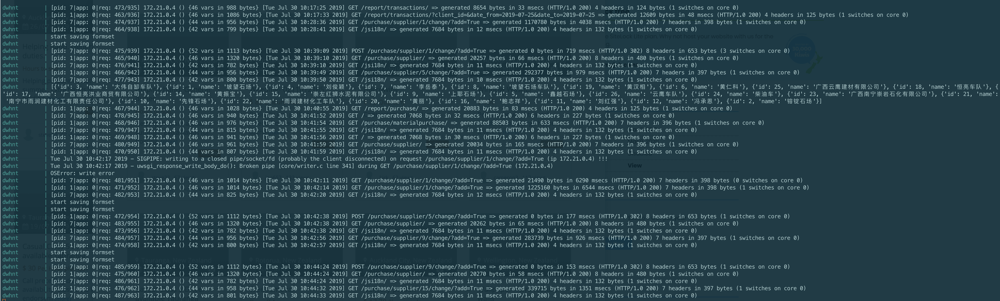

# uwsgi Broken pipe

Created: Jul 30, 2019 2:49 PM
Last Edited Time: Aug 02, 2019 9:58 PM
Status: Draft
Tags: Issue,uwsgi

# Issue Description

1. Happen when saving purchase formset in Supplier Admin page.

# Reason

May cause by the multiple actions of calculating and saving the summary records that every time a purchase record is saved.

# Possible Solution

## 1. Change signal to crontab

**Drowback** of this approach is: 

1. Can't see the data change right after the user submit new data. Add a **[Update Now]** botton to manually update
2. Extra effort to setup crontab on server
3. Every time restart container may need to restart crontab service

## 2. Set the `max_num` to inline formset

This is a workaround, it reduces the times of database writing at the same request. So as to reduce the possibility of Broken pipe or connection timeout! 

    # apps/purchase/admin.py
    class MaterialPurchaseInline(BaseTransactionInline):
        model = MaterialPurchase
        form = MaterialPurchaseInlineForm
        max_num = 10 # <---- also set to BaseTransactionInline

# Action Plan

1. **Exame my Hypothesis:** Stop the signals submit a 30 records formset, see if error accore.
- If yes:
    1. Write another view linked to a botton to manually update the record
    2. Create a crontab
- If Not:
    1. Seek other solution