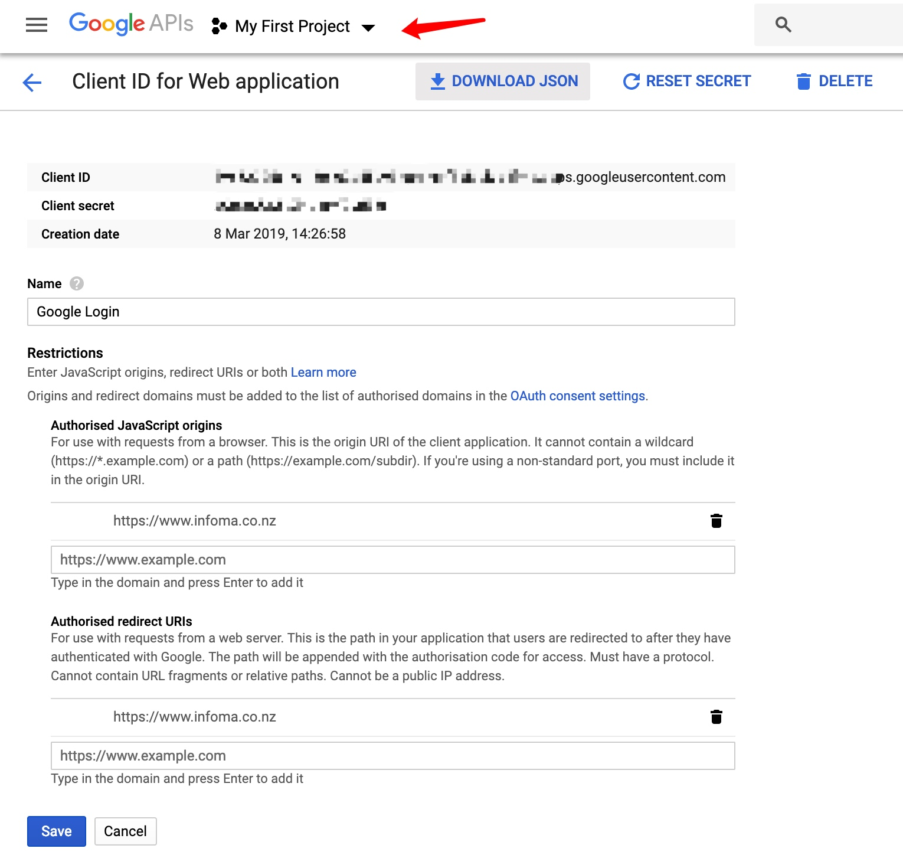
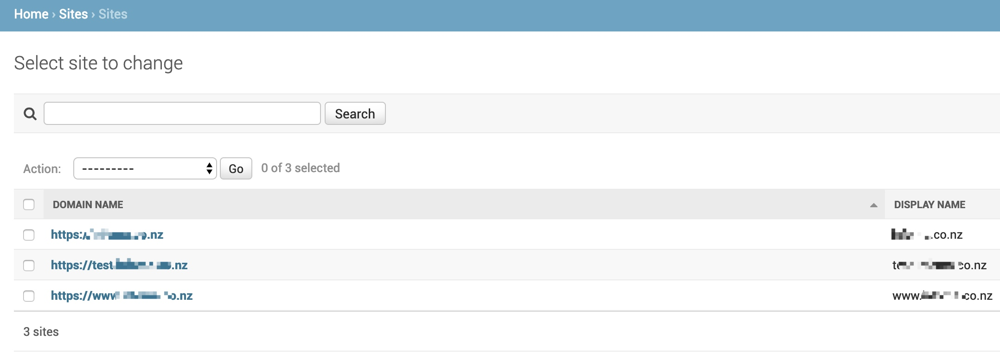
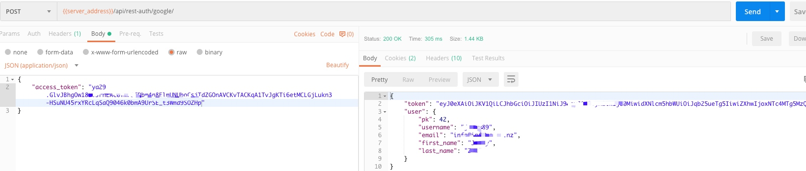
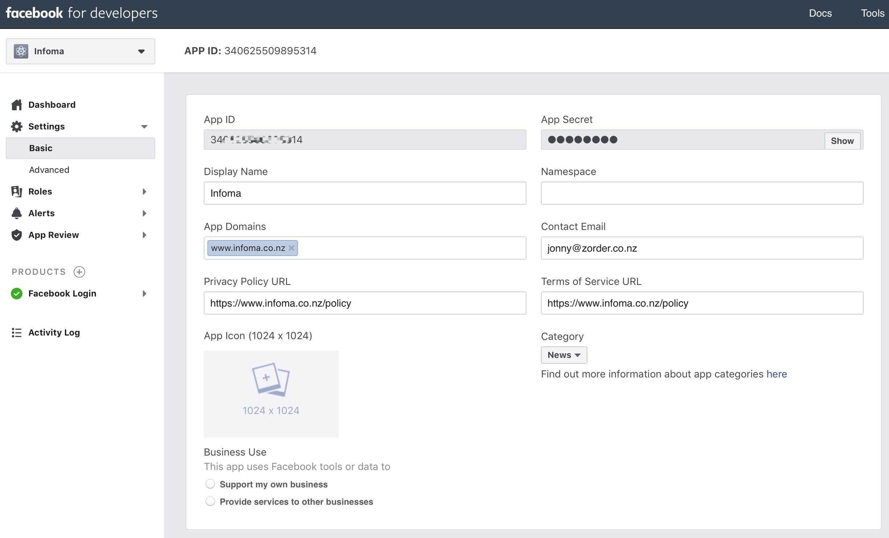

# Django REST Social Login
> Confidential


| APP | ID | Theia2019 |
| --- | --- | --- |
| Facebook | jonny@zorder.co.nz | Theia2019 |
| Google | info@infoma.co.nz | infoma2018 |

[TOC]

## Google
- **ID & Secret** 

- Add your domain to site table

(Don't quite understand what `SITE_ID=1` is for, but if somebody said this ID indicate the site you use in site table. If you get app SocialApp.DoesNotExist change it to 2 or 3)


```py
# views.py
from allauth.socialaccount.providers.facebook.views import (
    FacebookOAuth2Adapter
)
from allauth.socialaccount.providers.google.views import (
    GoogleOAuth2Adapter
)

from rest_auth.registration.views import SocialLoginView, SocialConnectView


class FacebookLogin(SocialLoginView):
    adapter_class = FacebookOAuth2Adapter


class FacebookConnect(SocialConnectView):
    adapter_class = FacebookOAuth2Adapter


class GoogleLogin(SocialLoginView):
    adapter_class = GoogleOAuth2Adapter


class GoogleConnect(SocialConnectView):
    adapter_class = GoogleOAuth2Adapter
```

- Add urls

```python
# <proj>/urls.py
urlpatterns = [
    ....
    path('rest-auth/facebook/', FacebookLogin.as_view(), name='fb_login'),
    path('rest-auth/google/', GoogleLogin.as_view(), name='gl_login'),
    ....
]
```




## Facebook
Register Facebook Developer




- Create Project
- Create APIs
- Create OAuth client ID
- client ID

https://django-allauth.readthedocs.io/en/latest/overview.html

https://www.youtube.com/watch?v=mmHn5XYlgto
How to install Allauth package and use it to add Facebook login feature.
- Installation
pipenv install django-allauth
- Sites

```python
# settings.py
AUTHENTICATION_BACKENDS = (
    # Needed to login by username in Django admin, regardless of `allauth`
    'django.contrib.auth.backends.ModelBackend',
    # `allauth` specific authentication methods, such as login by e-mail
    'allauth.account.auth_backends.AuthenticationBackend',
)
```

- Add Social App
 
```py
INSTALLED_APPS = [
    'django.contrib.sites',

    'allauth',
    'allauth.account',
    'allauth.socialaccount',
]
```

```bash
 ./manage.py migrate 
```

- Localhost SSL (https)

```bash
pipenv install --dev django-extensions Werkzeug pyOpenSSL
pipenv run ./manage.py runserver_plus --cert-file /tmp/cert
```


- Valid OAuth Redirect


```
https://test.infoplus.co.nz:443/account/facebook/login/callback
https://www.infoplus.co.nz:443/account/facebook/login/callback
https://infoplus.co.nz:443/account/facebook/login/callback
https://test.infoplus.co.nz/account/facebook/login/callbackRemove
```
想不到facebook 443 端口也要写出来，没有不行，一直说没有在白名单里，坑

- Default Login Redirect
- Welcome Message For Authenticated Users
- Override Templates
- Allow Login With Email

```
pipenv install django_extensions

INSTALLED_APPS = {
    'django_extensions',
}

ACCOUNT_DEFAULT_HTTP_PROTOCOL = "https"
LOGIN_REDIRECT_URL = '/'
```

```
python manage.py runserver_plus --cert-file /tmp/cert

https://127.0.0.1:8000/accounts/facebook/login/callback
```

## Twitter
1. Add a Project <https://console.actions.google.com/?pli=1>
2. Create a new OAuth client ID <https://console.developers.google.com/apis/dashboard?project=infoplus-44200&organizationId=787318952188&duration=PT1H>