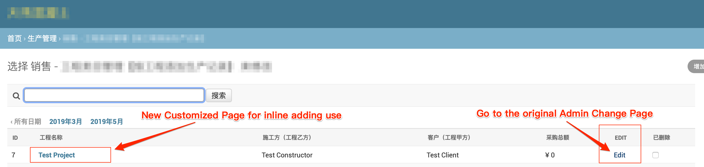

# Show Tables in Admin Change Page

**Result:**

1. Admin Changlist Page with `edit tag`

2. New Customized Page for inine adding use

**Procedure**

1. Create model methods displaying table html
2. Add method to ModelAdmin
3. Override change_view method to show 