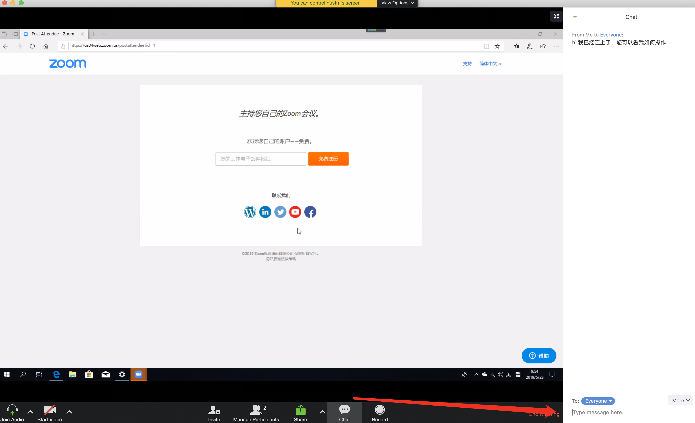

# 如何用 Zoom 实现远程桌面协助

## 准备工作

1. 登录 https://www.zoom.us/

2. 可能要注册一下吧，也许不注册也行，反正我注册了

3. HOST A MEETING - WITH VIDEO OFF 因为我不想别人看到我

4. 然后会让你下载一个插件，安装之，形如：

   

##  诉求1. 我要远程协助对方：

### 举例：我的电脑 Mac 英文版，远程协助客户的电脑 Windows 10中文版

1. 我发起（host）一个Meeting，不勾选 start vith video，目的是不打开我这边的摄像头

2. 然后copy meeting URL，发给对方

   

3. 对方收到URL后拷贝到浏览器打开，对方下载 Zoom 插件，然后开启分享屏幕

   

4. 从我的电脑发起远程控制要求

   

5. 对方电脑接受我的控制请求

   

6. 还有一个很方便的功能就是信息对话吧

   

   

🔚

