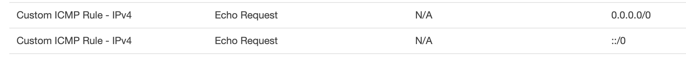

# Deploy Django Project to AWS EC2

> Confidential Information included

[TOC]


## Create a Server on EC2
**Create an EC2 instance**
1. choose ubuntu server
2. Set volume size to 30G at step: add volume
  
3. Download key.pem
4. mv key.pem to ~/.ssh
5. chmod 400 ~/.ssh/key.pem
6. Start instance
7. from console copy Pub DNS (IPv4)
8. connect Linux via ssh
```sh
# don't forget to set the user to default 'ubuntu'
ssh -i ~/.ssh/django.pem ubuntu@your.compute.amazonaws.com
```
**Need a persistent Public IP for domain setting**
1. Create a Elastic IP of your own
2. Assign this IP to you instance
3. When instance ip is change or stop "you should reassociate it with its Elastic IP after you start the instance again -AWS"


**Need to allow ping a instance**
1. In security group add inbound rule

2. In outbound rules add corresponding `Echo Reply` Protocol
3. Try ping your Elastic IP.

## Configure EC2 ubuntu

### Config SSH Login For EC2
```
# add to ~/.ssh/config
Host infoplus
  HostName your.compute.amazonaws.com
  AddKeysToAgent yes
  UseKeychain yes
  User ubuntu
  IdentityFile ~/.ssh/django.pem
```

### Config SSH Login for a fresh Ubuntu

- Add rsa key
```sh
$ ssh-keygen -t rsa -b 2048
Generating public/private rsa key pair.
Enter file in which to save the key (/home/username/.ssh/id_rsa): 
Enter passphrase (empty for no passphrase): 
Enter same passphrase again: 
Your identification has been saved in /home/username/.ssh/id_rsa.
Your public key has been saved in /home/username/.ssh/id_rsa.pub.

# Copy your keys to the target server:
$ ssh-copy-id id@server

# Now try logging into the machine, with ssh 'id@server', and check in:
.ssh/authorized_keys

# to make sure we haven’t added extra keys that you weren’t expecting.

# Finally check logging in…
$ ssh id@server

id@server:~$ 
```

- Confit the key & host mapping in `~/.ssh/config`
```
mv ~/.ssh/id_rsa ~/.ssh/id_rsa_server1

# Example
Host server1
    HostName server1.example.com
    User test
    Port 4242
    IdentityFile ~/.ssh/id_rsa_server1
```

### Optimile Terminal
```sh
# Tab auto-completion case-insensitive in the terminal
echo set completion-ignore-case on | sudo tee -a /etc/inputrc
```

```sh
# add below to ~/.bashrc
alias ..='cd ..; pwd'
alias ...='cd ..; cd ..; pwd'
alias gi='cd ~/InfoPlus'
alias oa='cd ~/theia-oa'
```

### Setting up Ubuntu
#### Install Docker to Ubuntu
```sh
# Tested in Ubuntu 16.04 & 18.04
sudo apt-get update
sudo apt-get install \
    apt-transport-https \
    ca-certificates \
    curl \
    software-properties-common
    
curl -fsSL https://download.docker.com/linux/ubuntu/gpg | sudo apt-key add -

sudo apt-key fingerprint 0EBFCD88
sudo add-apt-repository \
   "deb [arch=amd64] https://download.docker.com/linux/ubuntu \
   $(lsb_release -cs) \
   stable"
   
```
- if seen **Malformed input, repository not added.**
```
# Do
sudo add-apt-repository    "deb [arch=amd64] https://download.docker.com/linux/ubuntu \
   Ubuntu Bionic \
   stable"
# 

sudo vi /etc/apt/sources.list.d/additional-repositories.list
# Change into below
deb [arch=amd64] https://download.docker.com/linux/ubuntu bionic stable
```

```

sudo apt-get update

sudo apt-get install docker-ce
sudo docker run hello-world
```

#### Manage Docker as a non-root user 
```
sudo groupadd docker
sudo usermod -aG docker $USER
exit
# Re ssh to ubuntu
```

##### Install Docker Compose
- Open [ Compose repository release page on GitHub.](https://github.com/docker/compose/releases) check the latest version.
- replace the /1.23.2/ with the latest version
```
sudo curl -L https://github.com/docker/compose/releases/download/1.23.2/docker-compose-$(uname -s)-$(uname -m) -o /usr/local/bin/docker-compose

sudo chmod +x /usr/local/bin/docker-compose
sudo docker-compose --version
```

## Setting up Git
### Install
```
sudo apt update
sudo apt install git
git --version
git config --global user.name "Chunkai"
git config --global user.email "willcute@gmail.com"
git config --list
```

### Authenticating to GitHub

#### Adding your SSH key to the ssh-agent
```
# if .ssh doesn't exist on EC2
ubuntu@ip-172-31-8-93:~$ mkdir ~/.ssh
```

```
# upload private key to EC2 ~/.ssh
scp -i ~/.ssh/theia-infoma.pem ~/.ssh/id_rsa_git ubuntu@ec2-13-211-58-4.ap-southeast-2.compute.amazonaws.com:~/.ssh
```

#### set private key in config
```
cd ~/.ssh
cat > ~/.ssh/config <<EOF
Host github.com
 AddKeysToAgent yes
 IdentityFile ~/.ssh/id_rsa_git
EOF
```

#### Clone without password required
```
cd ~
git clone git@github.com:chunkai-meng/InfoPlus.git
```


#### Start Django Project
```
cd ~/InfoPlus
docker-compose up loc-dev
```

### WiKi
- 获取用于启动实例的 AMI 的默认用户名称
- 对于 Amazon Linux AMI，用户名为 ec2-user。
- 对于 Centos AMI，用户名称是 centos。
- 对于 Debian AMI，用户名称是 admin 或 root。
- 对于 Fedora AMI，用户名为 ec2-user 或 fedora。
- 对于 RHEL AMI，用户名称是 ec2-user 或 root。
- 对于 SUSE AMI，用户名称是 ec2-user 或 root。
- 对于 Ubuntu AMI，用户名称是 ubuntu 或 root。
- 另外，如果 ec2-user 和 root 无法使用，请与 AMI 供应商核实


## AWS Linux 实例磁盘空间扩容
> 大致步骤：
> 1. 调整卷大小
> 2. 调整分区大小
> 3. 调整文件系统大小
>
> 参考文章：[通过给EBS类型的根设备扩容解决AWS磁盘容量已满](https://www.jianshu.com/p/78fb1dcda633)

### 1. 调整EBS存储卷大小
进入控制台，选择 EBS - Volumes -Action - Modify Volume


### 2. 登录实例调整分区
首先使用`lsblk`可以查看附加到实例上的所有存储卷的真实size以及分区情况


存储卷已经调整为25G
其上只有1个分区 【1】显示为 xvda1
并没有占用全部空间

下面调整分区【1】使其占用全部卷可用空间
`sudo growpart /dev/xvda 1`


分区大小跟EBS大小一样了


但文件系统空间还没有识别到这部分新增的空间


### 3. 调整实例的文件系统进行扩容：
`sudo resize2fs /dev/xvda1`


Size变为25G，Done


```
注：
- 挂载在根目录上的是EBS存储卷上的分区而不是这个卷，而且卷被扩容但是分区大小不变依旧不能扩容
- xvda是一个存储卷，xvda1是存储卷上的一个分区，但是发现并不是一个存储卷被挂载到根而是存储卷上的一个分区被挂在跟上
- EBS 存储卷视为容器，则分区是卷中的另一个容器，并且数据位于分区上。
- EBS 相当于一块外部磁盘，如果实例损坏，无法启动可用挂载到别到实例上读取数据。
```
