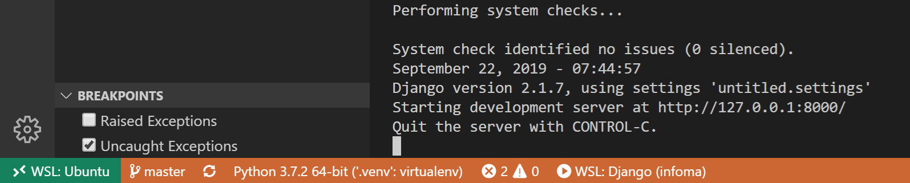

# Setting up Django in WSL and VSCode 

> Windows 10 pro, WSL: Ubuntu 18.04

From setting up WSL, install python and python venv to launch VSCode from WSL, finally start remote coding.

[TOC]

## Description
**Main Steps**
1. Install Oh-My-Zsh (optional)
2. Install Python (via pyenv)
3. Clone Code
4. Install pipenv
5. Setup Code (under {projectfolder}/.vscode/)

## Step-by-Step

### Install Oh-My-Zsh

install *zsh* - [official site](https://dev.to/mskian/install-z-shell-oh-my-zsh-on-ubuntu-1804-lts-4cm4).

```shell
sudo apt-get update
sudo apt upgrade
sudo apt install zsh
sudo apt-get install powerline fonts-powerline
```

install *oh-my-zsh* - [official site](https://ohmyz.sh/):

```shell
sh -c "$(curl -fsSL https://raw.github.com/robbyrussell/oh-my-zsh/master/tools/install.sh)"
```

Don't forget

```shell
# Load pyenv automatically by adding
# the following to ~/.bashrc:
export PATH="/home/hustmck/.pyenv/bin:$PATH"
eval "$(pyenv init -)"
eval "$(pyenv virtualenv-init -)"
```


### Install Python with apt

List all Python Version

```shell
ls /usr/bin/python*
```

Uninstall Old Python *Optional*

```shell
sudo apt autoremove python
```

Install Python

```shell
sudo apt install python3.7
```

Add soft link

```shell
 sudo ln -s /usr/bin/python3.7 /usr/bin/python3
```

Add to PATH

```shell
# ~/.zshrc  if using zsh
export PATH=$PATH:/usr/bin/python3.7
```

Test

```shell
python --version
```


### Install via pyenv

Install Python

```shell
# you can check available versions
pyenv install — list

# install python
pyenv install 3.7.2

# set default version
pyenv global 3.7.2

# check using python version
pyenv versions
```

If success, go to next step **Install pipenv**:

```shell
# if see "ImportError: No module named '_ctypes"
sudo apt-get install libffi-dev
	
# if "configure: error: no acceptable C compiler found in $PATH"
sudo apt-get install build-essential
 	
# or install below directly
sudo apt-get install -y make build-essential libssl-dev zlib1g-dev libbz2-dev \
libreadline-dev libsqlite3-dev wget curl llvm libncurses5-dev libncursesw5-dev \
xz-utils tk-dev libffi-dev liblzma-dev python-openssl git
```


### Install pipenv

```shell
pip install pipenv
```


### Clone Repository

```shell
git clone xxx.git
# Go to the folder where Pipfile located, for me it's "proj"
cd proj
```

### Install Virtual Environment

```shell
pipenv install
```

If success, Go to **Start VSCode**

if see something like:

```shell
# OSError: [Errno 8] Exec format error: '/mnt/c/Users/hustm/AppData/Local/Microsoft/WindowsApps/python.exe'
```

Then add the python path parameter

```shell
which python3
/home/ck/.pyenv/shims/python
pipenv install --python=/home/ck/.pyenv/shims/python
```

if install dev packages

```shell
pipenv install --dev --python=/home/ck/.pyenv/shims/python
```

## Start VSCode

```shell
code .
```

**Make sure WSL extension: Python already installed**

Edit or add

```json
# .vscode/launch.json
{
    "version": "0.2.0",
    "configurations": [
        {
            "name": "Windows: Django",
            "type": "python",
            "request": "launch",
            // change below if your manage.py in different location
            "program": "${workspaceFolder}\\proj\\manage.py",
            "args": [
                "runserver",
                // "--noreload"
            ],
            "django": true
        },
        {
            "name": "WSL: Django",
            "type": "python",
            "request": "launch",
            // change below if your manage.py in different location
            "program": "${workspaceFolder}/proj/manage.py",
            "args": [
                "runserver",
                // "--noreload"
            ],
            "django": true
        }
    ]
}
```

Edit (set font Family to show invisible characters)

```json
.vscode/settings.json
{
    "terminal.integrated.fontFamily": "Meslo LG M DZ for Powerline",
    // can use 'pipenv --venv' to find your own path
    "python.pythonPath": "${workspaceFolder}/proj/.venv/bin/python",
    "python.linting.flake8Enabled": true,
    "python.linting.enabled": true
}
```

Done




#WSL