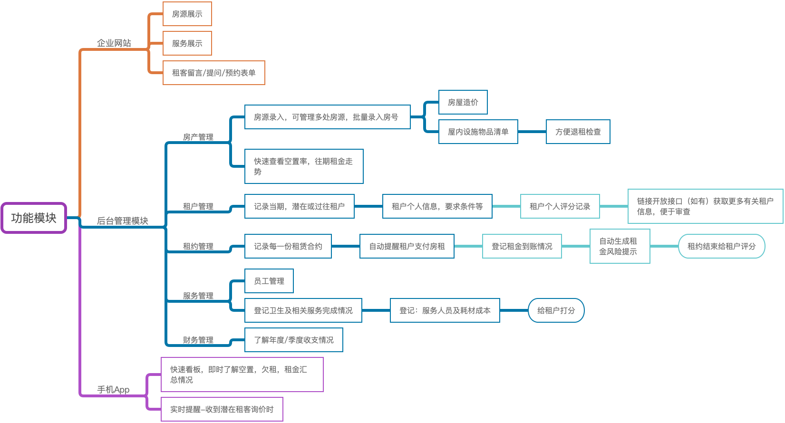
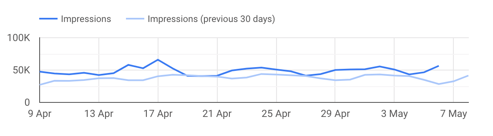

# House Leasing Management System

**A Cloud-based Web Application Providing:**

- Multi-user login, privilege management
- House/apartment management
- Tenant management
- Contract management
- Service management
- Price and Accounting management

**Technical Advantage:**

- Powerful Server System based on Amazon Cloud Computing
- Mulitple platform suport: PC & iOS Android phone

## 1. 总体说明：

1. 多用户登录，老板，员工，租户分权限查看/管理不同功能模块
2. 分阶段实施，网站，管理软件，移动端APP，按需选择，部分管理后台功能亦为可选项，控制开放成本
3. 云端软件服务，随时随地打开浏览器即可使用
4. 安全的服务器（可选：亚马逊澳大利亚云服务器，或新西兰本地托管服务器）
5. 成熟的开发技术及架构，支持未来的数据交互和大数据分析
6. 移动端支持（如果需要，建议在下一个阶段再开发）

**软件功能架构：**

## 2. 具体描述：

### 2.1 租户个人信息列表：

- 姓名电话等
- 身份验证信息，ID，扫描上传
- 个人要求
- 租户标签🏷️： 无烟，宠物，学生，工作/行业，单身，家庭成员，族群等，以便未来大数据分析，给出议价空间
- 好评记录/不良记录
- 综合评分

### 2.2 房屋信息列表：

- 名称，地址，户型描述，屋内设施清单

- 房屋标签🏷️：

  - 户型：朝向，楼层，年代，停车位，管理费
  - 地段：商业，校区，交通，，族群比例，经济指数，更多标签逐步增加

- 价格：当前价，历史价，浮动区间（示意图如下：）

  

- 适宜居住人群：

- 对租客的要求：

- 房屋卖点描述：

- 相关文件上传：

- 历史租客列表：

- 租客对房屋的建议及历史评价：

### 2.3 租约信息列表：

- 租金、押金、收租周期
- 一份租赁合同需要记录的有关信息

### 2.4 服务记录列表：

- 服务内容
- 服务人员
- 服务时间
- 相关耗材
- 服务情况记录

### 财务管理：

- 各类财务信息汇总：
- 制定各类消息提醒：
- 看板：

