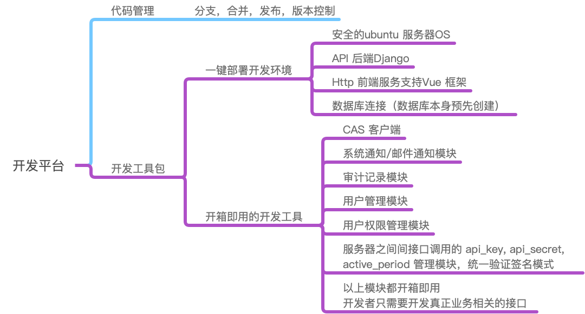
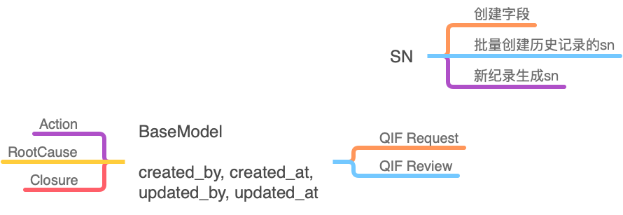
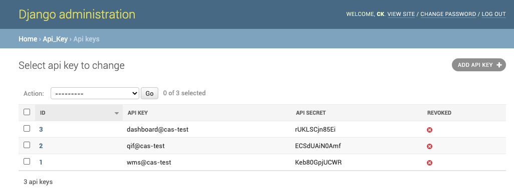

# Django RESTful DevOps Tool kit

> Created: Chunkai Meng
>
> Updated: 7 Jul 2020




## Docker-compose

- http server
- ftp server
- ssl


## ORM 构建过程

BaseModel 解决公共字段以及对应的处理函数
e.g.

```python
created_by, created_at, updated_by, updated_at
```



## Tool Kits

pip install package-name.tar.gz

### 1.  Cas client
验证登录登出

### 2. In-Site Message & Email Notification

e.g.
```python
from email_notification.models import EmailNotification, Template

email_dict = {
        'if_email_notify': True,
        'notification_title': 'New Checkout Request',
        'notification_message': 'New Checkout Request',
        'notification_to_group': email_to_group,
        'email_template': template_obj,
        'body_value1': instance.sn,
        'body_value2': instance.resources,
        'body_value3': instance.request_comment,
        'body_value4': settings.DOMAIN,
        'body_value5': instance.created_by.cn_name,
        'body_value6': instance.created_at
    }
    email_notification = EmailNotification(**email_dict)
    email_notification.save()
```

### 3. 审计记录模块

```python
import HistoricalRecords

history = HistoricalRecords(app="audit", custom_model_name=lambda x: f'Inventory{x}')
```

- 自动分析模型中的字段
- 自动跟随模型的变更而变更
- 自动记录数据表内容变化历史以及操作人，操作时间

### 4. 用户管理模块 Accounts 包
- 自动完成跟CAS 用户的同步

### 5. 用户角色管理
- 利用用户所在的组作为其角色管理
- 获取用户信息同时获得用户所在分组
- 分组针对 api 接口进行限制
```python
from rest_framework import permissions
IsOwnerOrReadOnly

IsQualityTeam

IsQIFHandler
....
class ClosureViewSet()
    permission_classes = (IsQualityTeam,)
```

```python
@action(methods=['post'], detail=True,permission_classes = (IsQualityTeam,))
def assign(self, request, pk=None):
    pass
```


### 6. 服务器间接口调用加密 Api-Key 包
- 举例： 将一个普通请求进行签名加密
```python
from api_key.utils import sign_request
from api_key.models import ApiKey


new_url = sign_request(url, key.api_secret)
requests.get(new_url, verify=False)

```

- 将一个普通的接口，加密开放到公网
```python
from api_key.permissions import CheckApiKeyAuth, CheckSourceIP, CheckApiKeySign

class UserListView(APIView):
    permission_classes = (CheckApiKeySign, CheckSourceIP)

    def get(self, request, format=None):
        wrap your data
        return JsonResponse(data)
```

API账号密码管理后台


### 6. 附件上传下载及管理后台
- 可以设定上传和下载的权限
- 采用串流下载的方式，不提供 http 直接访问附件更安全高效

### 7. 定时任务管理

- 可在本系统起定时任务服务
- 也可以让调度服务器定时调用本地接口实现定时任务